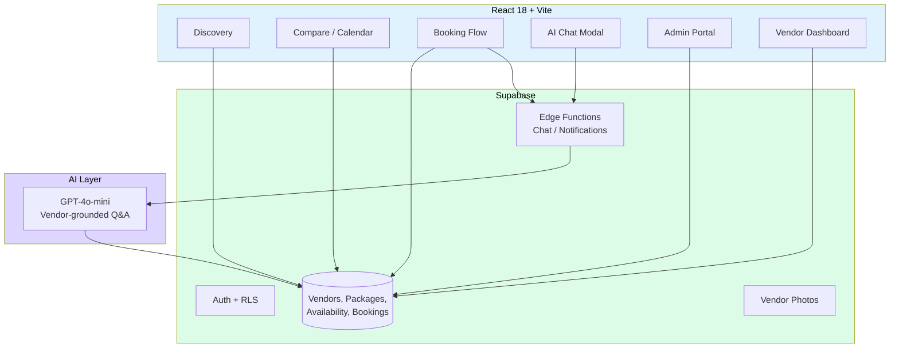

# WedMe

> **Nepal's first AI-powered direct-booking platform for weddings and events.**
> Couples connect with verified vendors directly — transparent pricing, hourly availability, real-time chat, AI Q&A. No middlemen, no commission.


---

## The problem

Wedding planning in Nepal is entirely offline:
- Couples spend weeks on WhatsApp chains and referral networks
- Vendors are scattered across Facebook and Instagram with no way to compare
- Middlemen take 15–30% commission without adding real value
- Zero real-time availability — double bookings happen constantly

## The solution

**WedMe** turns the discovery → comparison → booking flow into a single platform with three product surfaces:

1. **DISCOVER** — browse verified vendors with portfolios, packages, and transparent pricing. Have a question? Ask the AI chatbot and get instant grounded answers.
2. **COMPARE** — see hourly availability, per-plate catering prices, and budget-matched options
3. **BOOK** — tap the hours you want on the calendar, pick a package, confirm. Zero commission. Vendor confirms and those hours are automatically blocked.

## Architecture



**Three roles, one platform:**
- **Consumer** — browse, ask AI, book hourly slots, manage shortlists
- **Vendor** — manage profile, packages, availability calendar, booking requests, chat with consumers
- **Admin** — verify vendors, moderate content, customer detail views, analytics

## Engineering decisions

| Concern | Choice | Rationale |
|---|---|---|
| Frontend | **React 18 + Vite** | Fast HMR, smaller-than-Next.js bundle for an SPA-shaped product |
| State | **Zustand** | Minimal boilerplate vs. Redux; works well with Supabase realtime hooks |
| Routing | **React Router v6** | Standard SPA routing; nested layouts for vendor/admin/consumer surfaces |
| Backend | **Supabase** | Auth, Postgres + RLS, Storage, Edge Functions all in one — no separate API server to operate |
| AI | **GPT-4o-mini in Edge Function** | Vendor-grounded responses (queries vendor profile data before answering); cost-controlled per session |
| Auth | **Supabase Auth + role guards** | `AuthGuard` and `AdminGuard` components enforce protected routes |
| Booking model | **Hourly slots, vendor-confirmed** | Eliminates double-booking by atomic slot acquisition |
| Pricing | **Per-plate (catering) + per-package (other)** | Matches how Nepali vendors actually quote |

## Key features

- **Vendor discovery** with portfolio, packages, and reviews
- **Hourly availability calendar** — tap-to-select hours, vendor confirms, hours auto-block
- **AI chatbot** — grounded in vendor profile data, instant Q&A ("Do you cater Jain food?")
- **Vendor dashboard** — bookings, chat replies, package manager, availability manager, portfolio editor
- **Admin portal** — vendor list, customer list, vendor verification, customer detail
- **Shortlist + dashboard** for consumers to compare vendors
- **Phone OTP auth** via Supabase
- **Realtime chat** between consumers and vendors

## Status

- **50 commits** across foundation → vendor → AI chatbot → booking UX work
- **Sprint plans** for foundation, auth, consumer, vendor, polish — see `docs/superpowers/plans/`
- **Platform v2 spec** approved (board-level)
- **MVP demoable** with seeded Kathmandu vendor data

## Tech stack

**Frontend:** React 18, Vite, React Router v6, Zustand, Tailwind
**Backend:** Supabase (Auth, Postgres, RLS, Storage, Edge Functions)
**AI:** OpenAI GPT-4o-mini via Supabase Edge Function (`supabase/functions/chat/`)
**Quality:** Vitest unit tests (a11y, AuthGuard, store, landing page), perf smoke checks, GitHub Actions CI for FE a11y/perf
**Deployment-ready:** Vercel-compatible (Vite output)

## Local development

```bash
# Frontend
cd frontend
npm install
cp .env.example .env.local  # fill Supabase URL + anon key
npm run dev

# Supabase migrations (if running fresh)
supabase db reset  # applies migrations in order
```

Migrations live in `supabase/migrations/` — wedme schema, demo seed, booking platform, admin portal, AI chatbot, vendor chat replies, catering per-plate, booking UX improvements.

## Quality gates

- Accessibility smoke: `npm --prefix frontend run test:a11y`
- Performance budget: `npm --prefix frontend run test:perf`
- GitHub Actions workflow: `.github/workflows/fe-a11y-perf.yml` runs on every PR

## Roadmap

- [x] Foundation (auth, routing, state)
- [x] Consumer flows (discovery, vendor profile, shortlist)
- [x] Vendor flows (dashboard, packages, availability, chat)
- [x] Admin portal (vendor verification, customer detail)
- [x] AI chatbot (vendor-grounded Q&A)
- [x] Booking UX improvements (hourly slots, per-plate catering)
- [ ] Realtime chat polish
- [ ] Production deployment
- [ ] Vendor onboarding flow simplification

## About

Built by **Sadip Wagle** — Co-Founder of Datambit (London), AI Solutions Architect with production experience for the **UK Home Office, Royal Navy, Mastercard, and Nationwide**. Currently building indigenous AI products for Nepal.

- **LinkedIn:** [sadip-wagle](https://www.linkedin.com/in/sadip-wagle-711245b7/)
- **GitHub:** [@wsadip-tech-ai](https://github.com/wsadip-tech-ai)
- **Email:** wsadip@gmail.com

---

*WedMe is part of a portfolio that also includes [KaraDarpan](https://github.com/wsadip-tech-ai/KaraDarpan) (tax AI), [Kaam](https://github.com/wsadip-tech-ai/Kaam) (home services), [Astra](https://github.com/wsadip-tech-ai/Astra) (astrology AI), and [PartyPour](https://github.com/wsadip-tech-ai/PartyPour) (event beverage planning).*
